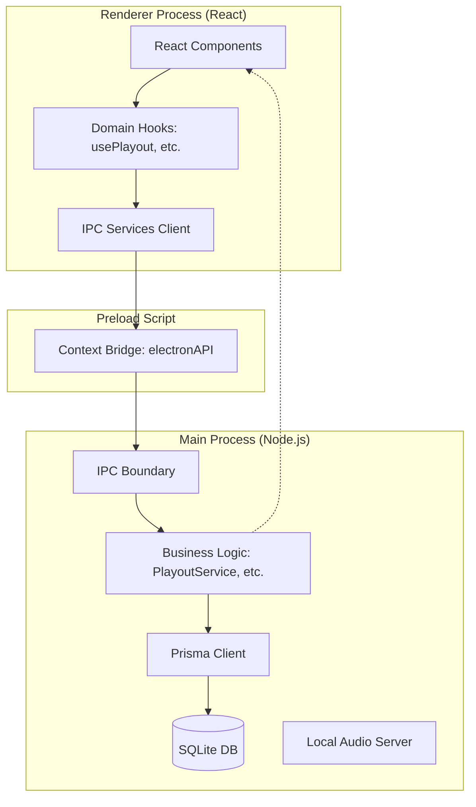

# Arquitectura General

Flux sigue la arquitectura estándar de **Electron**, separando las responsabilidades en procesos aislados para garantizar la estabilidad de la reproducción de audio incluso si la UI tiene problemas de rendimiento.

## Las Tres Capas

### 1. Main Process (`src/main/`)
Es el corazón del sistema. Tiene acceso directo a Node.js, File System y la base de datos.
- **`index.ts`**: Punto de entrada, gestiona el ciclo de vida de las ventanas y permisos.
- **`db.ts`**: Instancia global de Prisma.
- **`services/`**: Contiene la lógica pesada que debe sobrevivir a recargas de la UI (ej. Scheduler, Streaming).
- **Audio Server**: Flux levanta un servidor HTTP local interno para servir los archivos de audio con los headers CORS necesarios para que la Web Audio API pueda procesarlos sin restricciones.

### 2. Preload (`src/preload/`)
Actúa como un puente seguro entre el proceso Main (inseguro para la web) y el Renderer. Expone `window.electronAPI` utilizando `contextBridge` y `ipcRenderer`, permitiendo que el frontend llame a funciones del backend sin exponer APIs sensibles de Node.js.

### 3. Renderer (`src/renderer/src/`)
Una aplicación React moderna.
- **Pages/Components**: Construcción visual mediante CSS Modules.
- **Hooks**: Encapsulan la lógica de estado y la comunicación con IPC.
- **Types**: Definiciones compartidas de TypeScript para asegurar contratos de datos.

## Flujo de Audio (Resumen)

El flujo de audio es híbrido: el **Main Process** gestiona qué debe sonar (estado, colas, lógica de negocio), pero el **Renderer Process** es quien posee el `AudioContext` y realiza el renderizado de sonido real.

Para más detalle, ver [Audio Pipeline](audio-pipeline.md).
