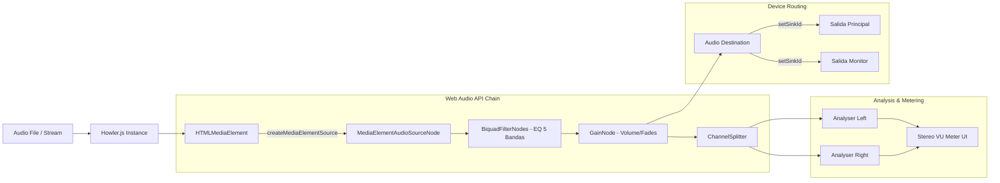

# Audio Pipeline

El manejo de audio en Flux es el componente más crítico del sistema. Utiliza una combinación de **Howler.js**, **Web Audio API** y elementos de audio HTML5 para lograr flexibilidad en el enrutamiento y procesamiento.

## Diagrama de Flujo

## Características Clave

### 1. Procesamiento via MediaElementSource
Para poder aplicar ecualización y obtener datos para los vúmetros (analysers), Flux debe "capturar" el audio del elemento HTML5.
- Al hacer esto, el audio deja de salir directamente por el hardware y pasa al grafo de la Web Audio API.
- Esto permite procesamiento en tiempo real con latencia mínima.

### 2. Multi-Output (Salida Principal + Monitor)
Flux permite enviar el audio a diferentes dispositivos físicos simultáneamente.
- **Principal**: El flujo que sale al aire.
- **Monitor**: Un flujo paralelo (que puede tener su propio control de volumen) para auriculares de cabina.
- Implementación: Se utilizan múltiples instancias de `Howl` o se clonan los nodos de salida, aplicando `setSinkId` en los elementos de audio subyacentes.

### 3. Manejo de AbortError (Chromium)
Un desafío técnico identificado en Flux es que Chromium lanza un `AbortError` si se intenta llamar a `setSinkId()` prematuramente o mientras el elemento está siendo capturado/conectado a un `AudioContext`.
- **Solución**: Flux implementa un re-intento con backoff y asegura que el estado del elemento sea estable antes de cambiar el dispositivo de salida.
- Ver detalles en el [ADR 0002](adr/0002-eq-via-mediaelementsource.md).

### 4. Crossfade y Gapless
El playout utiliza dos reproductores en paralelo cuando se acerca el fin de un track para realizar un crossfade suave (atenuación cruzada) definido en la configuración del perfil o del asset.
