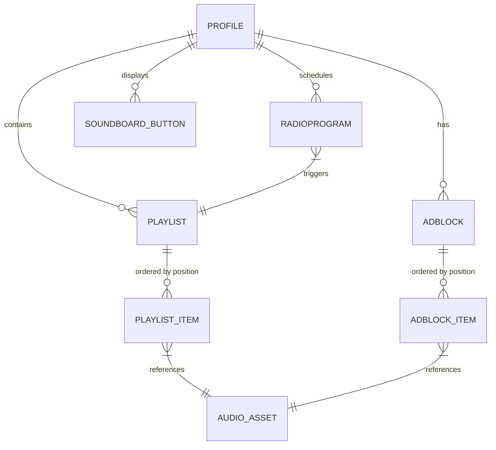

# Modelo de Datos

Flux utiliza **SQLite** como motor de base de datos persistente y **Prisma** como ORM. La base de datos se almacena localmente en la carpeta de datos de la aplicación (`%APPDATA%/flux/flux.db` en Windows).

## Entidades Principales

### `Profile` (Perfil)
La entidad raíz. Todo en Flux (Playlists, Tandas, Programas) pertenece a un perfil. Esto permite que varios operadores compartan la misma instalación con configuraciones totalmente distintas.

### `AudioAsset` (Asset de Audio)
Representa un archivo de audio en el disco.
- Almacena la ruta absoluta.
- Contiene metadatos calculados (duración en ms, tags).
- Define parámetros de playout: `fadeInMs`, `fadeOutMs`.

### `Playlist` e `PlaylistItem`
- Una **Playlist** es una colección ordenada de items.
- El **PlaylistItem** es la tabla relacional que asocia un `AudioAsset` con una `Playlist` en una posición específica.

### `AdBlock` y `AdRule` (Tandas)
- **AdBlock**: Un conjunto de audios publicitarios que se reproducen en secuencia.
- **AdRule**: La lógica de disparo. Puede ser por **Tiempo** (ej. "Lunes a las 10:00") o por **Contador** (ej. "Cada 3 tracks").

### `RadioProgram` (Programas)
Utiliza expresiones Cron para automatizar el cambio de Playlists. Define una ventana de tiempo (`startTime` a `endTime`) y una prioridad.

### `OutputIntegration`
Configuración de hardware de audio por perfil. Mapea "Tipo de Salida" (Main/Monitor) a un `deviceId` del sistema.

## Diagrama ER (Simplificado)

## Consideraciones de Diseño
- **Cascade Deletes**: Si se elimina un perfil, se eliminan todas sus configuraciones y listas (pero no los archivos físicos de audio).
- **Unique Constraints**: La posición de los items en las listas está protegida por restricciones únicas para evitar colisiones en la ordenación.
