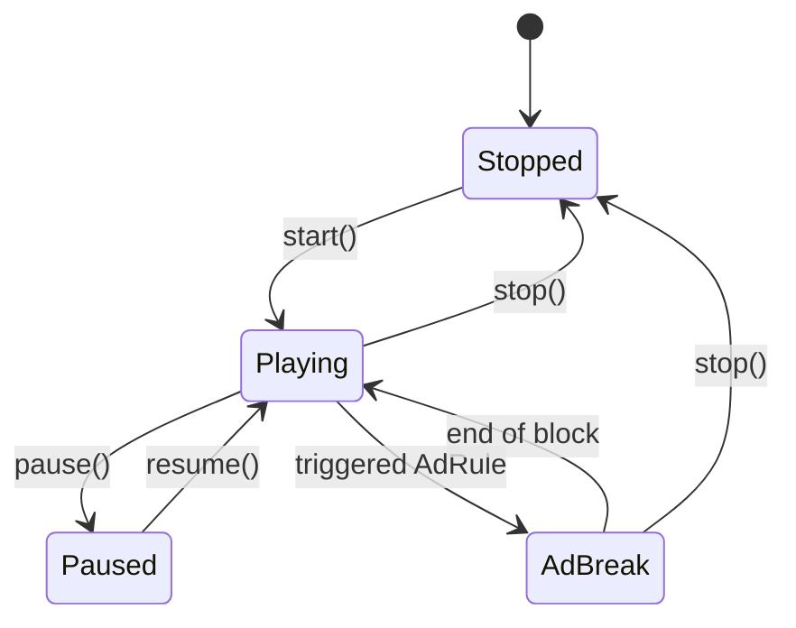

# Playout (Motor de Reproducción)

El módulo de **Playout** es el más complejo de Flux. Gestiona qué audio suena en cada momento, cómo se transiciona entre ellos y cómo se recupera ante errores.

## PlayoutService (Main Context)
Ubicación: `src/main/services/playoutService.ts`

El servicio en el proceso Main mantiene la "Verdad Única" sobre qué se está reproduciendo. Aunque el audio suena en el Renderer, el Main es quien:
1. Resuelve qué playlist debe sonar (basado en el Scheduler).
2. Mantiene el índice de la cola actual.
3. Cuenta cuántos tracks han pasado para disparar Tandas por contador.
4. Gestiona el estado global: `playing`, `paused`, `stopped`, `ad_break`.

## usePlayout (Renderer Context)
Ubicación: `src/renderer/src/hooks/usePlayout.ts`

Este hook de React es el encargado de la ejecución técnica:
- **Instancia de Howl**: Gestiona la carga del búfer de audio.
- **Web Audio API**: Conecta el audio al EQ y Analysers.
- **Auto-advance**: Cuando un audio termina (`onend`), solicita al Main el siguiente track.
- **Recuperación de Salida**: Si el dispositivo de audio cambia o desaparece, intenta re-enganchar el `sinkId` sin detener la reproducción.

## Máquina de Estados

## Características Especiales

### Fades y Crossfade
El sistema lee `fadeInMs` y `fadeOutMs` del `AudioAsset`. 
- Si hay un crossfade activo, el reproductor B comienza a subir el volumen mientras el A baja el suyo, solapándose durante N milisegundos.

### Resume post-tanda
Cuando una **Tanda** (Ad Break) se dispara por regla horaria, Flux pausa el playout musical (si la regla así lo indica) o espera a que termine el track actual. Una vez terminada la tanda, el playout retoma exactamente donde quedó o salta al siguiente track según la configuración.

### Gestión de Errores de Hardware
Si se intenta cambiar la salida de audio (`setSinkId`) y falla (ej. se desconecta el auricular), Flux captura el error y redirige el audio a la salida por defecto del sistema para evitar el silencio en el aire.
